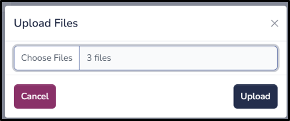
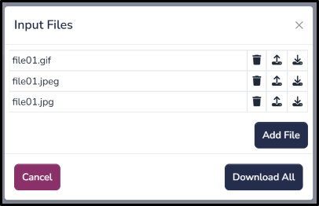
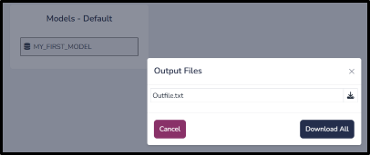

(files)=

# Files

Users can upload, download, and browse files using this functionality. All files are stored as blobs in the selected model, specifically in the **S_DataFiles** table. This table can be accessed from **All Other** > **Data Files**.

## Upload Files

**Navigation**: **Files** > **Upload Files**

Users can upload multiple files using this function. This will replace all existing input files with the selected files in the chosen SQLite model.

## Input Files

**Navigation**: **Files** > **Input Files**

Users can view, update, or delete existing input files. Additional input files can also be uploaded using this option. 

Before running Python code, these files are copied into the Pyodide file system under the **inputDir/** directory.

## Output Files

**Navigation**: **Files** > **Output Files**

Users can download all output files generated by Python code. Files appear in **Output Files** only if the corresponding Python code writes to the **outputDir/** directory.

After Python code execution, all files in the **outputDir/** directory are copied to the **S_DataFiles** table as blobs.
