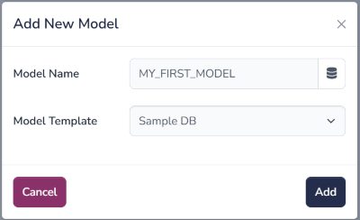
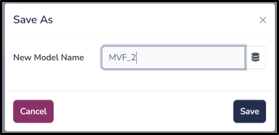
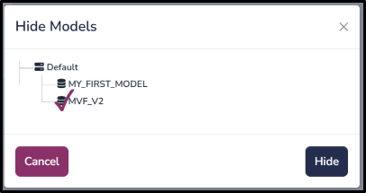
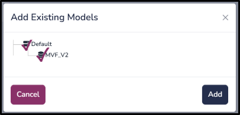
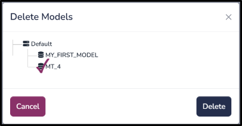
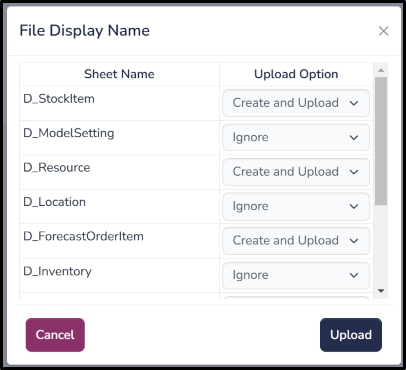
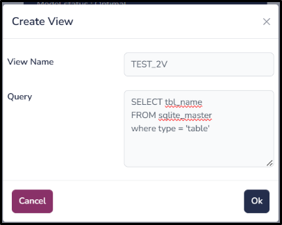
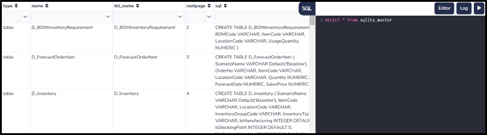
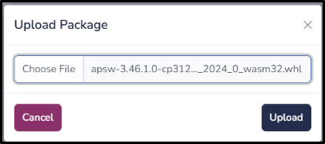

(model)=

# Model

A Model in ComputeLite is a SQLite file stored in the browser’s OPFS (Origin Private File System) storage. Each model has its own copy of data, code, input files and python packages. By default, ComputeLite offers a fixed set of methods to access/manage models.

## Add new model

Navigation: **Model** > **Add New Model**

User can add a new model using this function. Here, user must input a unique model name and select a template based on which ComputeLite will create SQLite schema

## Save as model

Navigation: **Model** > **Save As**

User can create a copy of an existing (selected) model using this function. Here, user must input a unique model name.

## Hide model

Navigation: **Model** > **Hide Model**

User can hide existing models using this function. Here, user may choose one or more models to be hidden as shown in image above.

## Add existing model

Navigation: **Model** > **Add Existing Model**

User can add hidden models back to Home Page using this function. Here, user may choose one or more models to be added in Home Page as shown in image above.

## Backup model

Navigation: **Model** > **Backup Model**

User can download a local copy of selected model (SQLite file) using this function. User may use this file to share/restore in the future.

## Restore model

Navigation: **Model** > **Backup Model**

User can restore a model if a local copy of selected model is available with user. 

User can choose the backup copy available on its machine and system will replace backup copy with current copy of selected model.

## Delete model

Navigation: **Model** > **Delete Model**

User can choose one or models to be deleted permanently from Compute Lite.

## Upload Excel

Navigation: **Model** > **Upload Excel**

User can choose to upload excel data in SQLite model to existing or new tables. Note that it will look for table headers in the first row.

For exiting tables, it will provide 3 options to choose from:

1. **Purge and Upload**: This is default option for existing tables. It will delete all the existing data from respective tables and then import data from excel.

2. **Create and upload**: This will drop existing table, recreate it and then import data from excel

3. **Ignore**: This will **NOT** delete/upload any data

For new tables, it will provide options 2 & 3. New Tables created could be navigated from **All Others** table group.

## Download Excel

Navigation: **Model** > **Download Excel**

User can download excel by selecting one or more **Table Groups**, it will download all existing tables under selected tablegroup. If user wants to download a selected table, user can download it from **TableDisplay** page

## Vacuum model

Navigation: **Model** > **Vacuum Model**

Vacuum is a SQLite functionality where it will defragment model to get better performance

## Create view

Navigation: **Model** > **Create View**

User can create a SQL view in the selected model. User Should input view name and a valid SQL query. This view can be accessed from Table Groups under **Views** group

## SQL Editor

Navigation: **Model** > **SQL Editor**

This will open a SQL editor page with selected model. User may write any DDL/DML queries here.

## Upload Package

Navigation: **Model** > **Upload Package**

If a python package in not available in Pyodide and it's not a pure python package, user may build their own package by following pyodide instructions at https://pyodide.org/en/stable/development/building-and-testing-packages.html User can then upload their own built wheel using this option.

