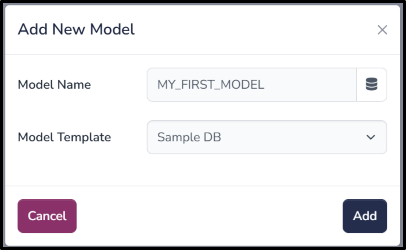

(model)=

# Model

A Model in ComputeLite is a SQLite file stored in the browser’s OPFS (Origin Private File System) storage. Each model has its own copy of data, code, input files, and Python packages. By default, ComputeLite offers a fixed set of methods to access and manage models.

## Add new model

**Navigation**: **Model** > **Add New Model**

Users can add a new model using this function. They must input a unique model name and select a template based on which ComputeLite will create the SQLite schema.

## Save As Model

**Navigation**: **Model** > **Save As**

Users can create a copy of an existing model using this function. They must input a unique model name.

## Hide Model

**Navigation**: **Model** > **Hide Model**

Users can hide existing models using this function. Multiple models can be selected to be hidden, as shown in the image above.

## Add Existing Model

**Navigation**: **Model** > **Add Existing Model**

Users can restore hidden models back to the Home Page using this function. Multiple models can be selected for restoration, as shown in the image above.

## Backup Model

**Navigation**: **Model** > **Backup Model**

Users can download a local copy of a selected model (SQLite file) using this function. This file can be used for sharing or restoring in the future.

## Restore Model

**Navigation**: **Model** > **Backup Model**

Users can restore a model from a previously backed-up local copy. 

Users must select the backup file on their machine, and the system will replace the current model with the backup copy.

## Delete Model

**Navigation**: **Model** > **Delete Model**

Users can permanently delete one or more models from ComputeLite.

## Upload Excel

**Navigation**: **Model** > **Upload Excel**

Users can upload Excel data into a SQLite model, either into existing or new tables. Note that the system expects table headers in the first row.

For existing tables, three options are available:

1. **Purge and Upload** (default): Deletes all existing data in the table and then imports data from the Excel file.
2. **Create and Upload**: Drops the existing table, recreates it, and then imports data.
3. **Ignore**: Does not delete or upload any data.

For new tables, only options 2 and 3 are available. Newly created tables can be accessed under the **All Others** table group.

## Download Excel

**Navigation**: **Model** > **Download Excel**

Users can download Excel files by selecting one or more **Table Groups**. This will download all tables within the selected group. Individual tables can be downloaded from the **TableDisplay** page.

## Vacuum Model

**Navigation**: **Model** > **Vacuum Model**

Vacuuming is a SQLite functionality that defragments the model to improve performance.

## Create View

**Navigation**: **Model** > **Create View**

Users can create a SQL view in the selected model. They need to input a view name and a valid SQL query. Created views can be accessed under the **Views** table group.

## SQL Editor

**Navigation**: **Model** > **SQL Editor**

This opens the SQL editor page for the selected model. Users can write DDL/DML queries here.

## Upload Package

**Navigation**: **Model** > **Upload Package**

If a Python package is not available in Pyodide or is not a pure Python package, users can build their own package by following the instructions at [Pyodide's official site](https://pyodide.org/en/stable/development/building-and-testing-packages.html). They can then upload the built wheel file using this option.
