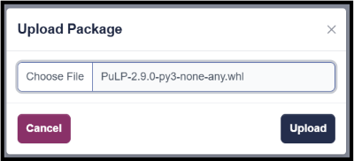

(pythoneditor)=

# Python Editor


User can input Python code in a clean and intuitive editor and run it by clicking the execute icon 
(highlighted in yellow). Upon execution, the output is displayed in a designated area.Python code 
execution leverages the Pyodide runtime for running Python in a web environment.

## Image Output


The user can also get the output as an image. To achieve this, additional code must be added to the existing code block. Below is an example:

```
# Sample code to display random dog images 
import urllib3, json, os,io
from pyodide.ffi import to_js

url = "https://random.dog/woof.json"
response  = urllib3.request("GET", url)
img_url = response.json()['url']

extension = ""

while extension not in ("JPEG", "PNG", "JPG", "GIF"):
  response  = urllib3.request("GET", url)
  img_url = response.json()['url']
  print(img_url)
  extension = img_url.split(".")[-1].upper()

response = urllib3.request("GET", img_url)

# Once the image response is retrieved, the following lines must be added to render the image:

buf = io.BytesIO(response.data)

to_js(buf.getvalue())

```
Additionally, user can download the output image by clicking the **Download** icon (highlighted in yellow).

## Upload/Download Files


User can upload or download Python code files in a zip format by clicking the respective icons (highlighted in yellow); when a zip file is uploaded, it replaces the existing files by deleting them and creating new ones from the uploaded content.


## File Management


User can add or delete files and folders as needed using the file management icons (highlighted in yellow). Any changes made to the files are instantly reflected in the editor, ensuring a seamless workflow. All files are stored within the selected model, specifically in the **S_ExecutionFiles** table. This table can be accessed from **Setups** > **Code Files**.


## Add To Home Page


User can add files from the Python editor to the homepage, enabling direct execution of a file’s code from the homepage. Once a file is added, it will appear under the **"Run"** dropdown menu on the homepage, displayed with the name specified at the time of addition.


## Load Package

To add and use Python packages in the editor, user can create a **requirements.txt** file in the root folder.This file allows the user to specify all the necessary packages for their project.

Users can utilize both pure Python packages and packages supported by Pyodide. A complete list of these packages can be found [Here](https://pyodide.org/en/stable/usage/packages-in-pyodide.html).


If a required package is not included in Pyodide, users can create pyodide packages and upload wheel files from the home page and integrate them into their code seamlessly.

**Navigation**: **Model** > **Upload Package**



All uploaded packages are stored as blobs in the **S_PackageWheels** table. This table can be accessed from **All Other** > **PackageWheels**.

In the requirements.txt file, the user should list all the package names line by line, avoiding spaces, commas, or specific version numbers. For example:

```
numpy
pandas
matplotlib

```
Once the packages are specified in requirements.txt, user can import and utilize them in the Python files where they are required. For example, if the user wants to use numpy in a file named script.py, they can do so like this:

```
import numpy as np

# Example usage
array = np.array([1, 2, 3])
print(array)

```
