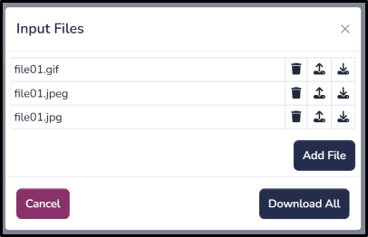

(quickstart)=

# Getting Started

A Model in ComputeLite is a SQLite file stored in the browser’s OPFS (Origin Private File System) storage. This file contains all the data and code for your project.

## Adding a New Model

1. Open [ComputeLite](https://computelite.com) in your browser.

2. Navigate to **Model** > **Add New Model**.

    

3. Enter a model name, select **Sample DB** as the model template, and click **Add**. (As shown in the image above)

## Importing Data

Users can import Excel data directly into a SQLite table or import any data as a blob in the model.

### 1. Importing Excel Data

Users may upload Excel data using this option. Note that it will look for table headers in the first row.

   a. Navigate to **Model** > **Upload Excel**.

   

   b. Select the Excel worksheets you want to upload.

   

   c. Click **Upload**. Once uploaded, you will see tables created, with a row count displayed in the status.

   

   d. The uploaded tables will appear under **Input Tables**, as shown in the screenshot below:

   

### 2. Importing Any Data

Users may upload data in any format using this option.

   a. Navigate to **Files** > **Upload Files**.

   b. Select multiple files if needed and click **Upload**.
   
   c. Navigate to **Files** > **Input Files**.

   

   d. This will display all the input files, as shown in the screenshot above. Users can add, update, or delete any file.

## Accessing Data from Python

Users can access data imported in the previous steps through Python code and write further code to process or transform data.

1. Click on the code editor icon  in the menu bar of the Home Page.
2. Access input files:

    ```python
    import os

    # This is the Input Directory (inputDir/), all input files uploaded from the homepage are copied to this folder
    print(os.listdir("inputDir"))
    ```

3. Access SQLite database:

    ```python
    import sqlite3

    # 'thisDB' is a keyword for the current SQLite database
    conn = sqlite3.connect(thisDB)

    for row in conn.execute("SELECT tbl_name from sqlite_master"):
      print(row[0])
    ```

4. Write Output Files

   Users may write directly to **thisDB** or write output files in any format, as shown below:

    ```python
    import os

    # This is the Output Directory, which is accessible from the Home Page. Any file written to this folder will be accessible from the Home Page.
    outputDir = 'outputDir/'
    output_file_name = f'{outputDir}Outfile.txt'
    with open(output_file_name, 'w') as fl:
      for i in range(10):
          fl.write(f'Hello from ComputeLite, count: {i} \n')
      fl.close()
    ```

5. Accessing Output Files

   a. Users can access output files written by code.
   b. Navigate to **Files** > **Output Files**.

   
