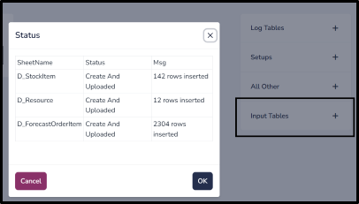

(quickstart)=

# Getting Started

A Model in ComputeLite is a SQLite file stored in the browser’s OPFS (Origin Private File System) storage. This file contains all the data and code for your project.

## Adding a New Model

1. Open [ComputeLite](https://computelite.com) in your browser.

2. Navigate to **Model** > **Add New Model**.

    

3. Enter a model name, select **Sample DB** as the model template, and click **Add**. (As shown in the image above)

## Importing Data

Users can import Excel data directly into a SQLite table or import any data as a blob in the model.

### 1. Importing Excel Data

   a. Navigate to **Model** > **Upload Excel**.

   

   b. Select the Excel worksheets you want to upload.

   

   c. Click **Upload**. Once uploaded, you will see tables created, with a row count displayed in the status.

   
