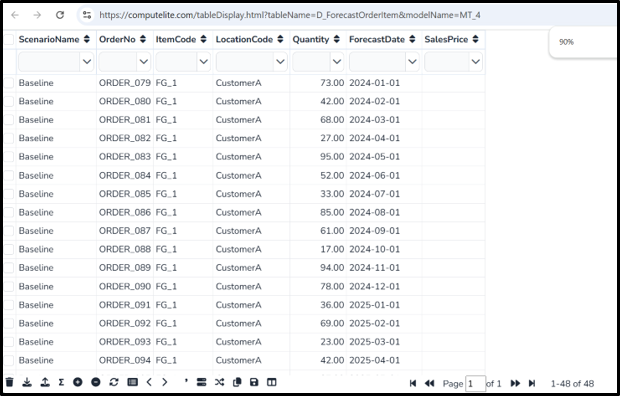
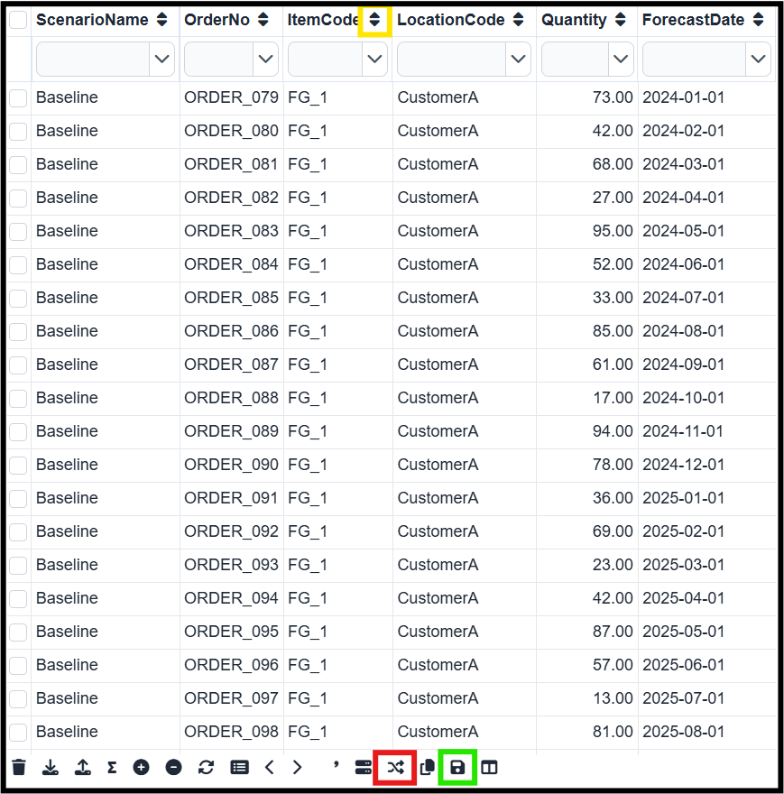
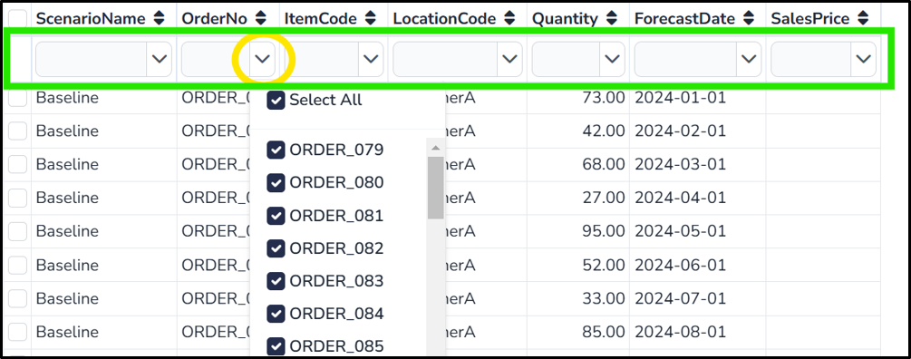
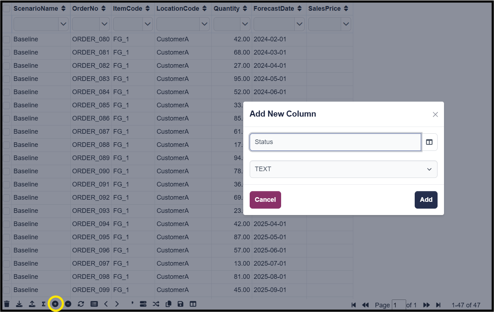
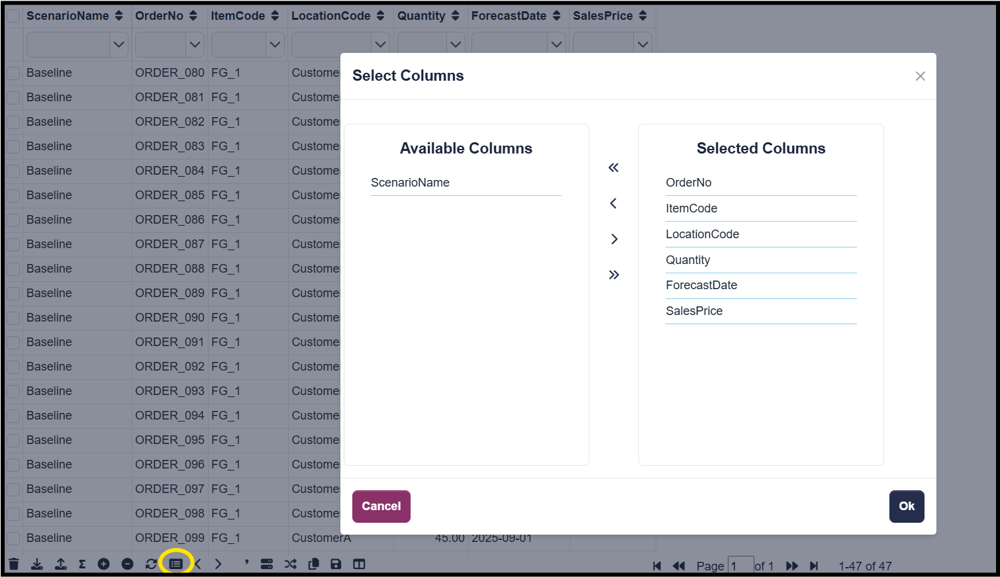
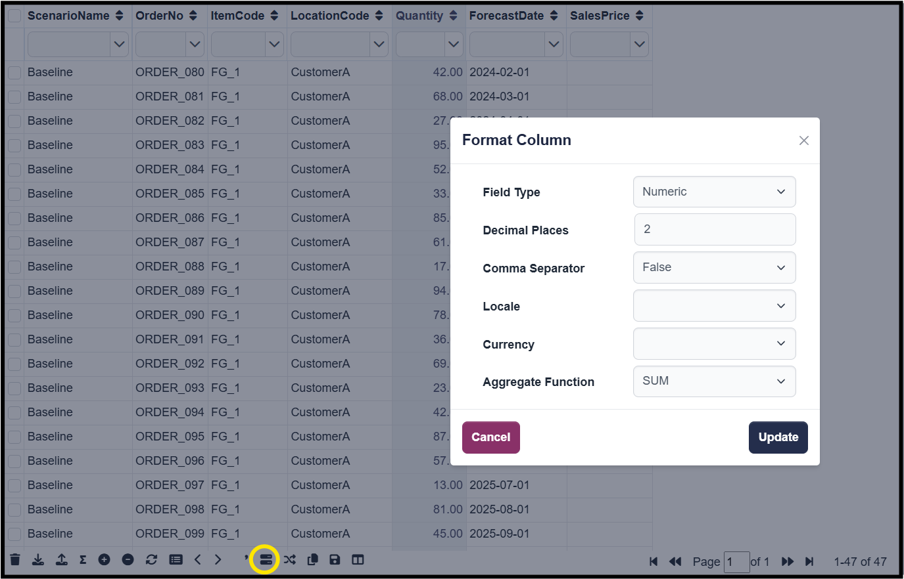
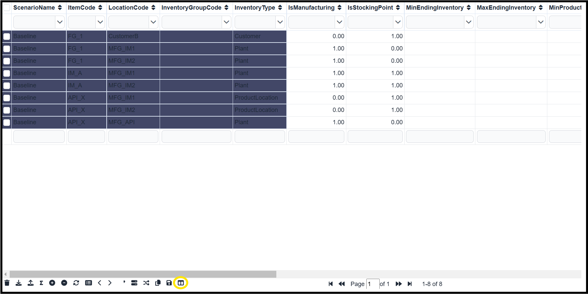

(table)=

# Table Display

User can view/insert/update and delete SQLITE data tables from **Table Display** page



A Table is editable, only if it is characterized as an **Input** table in **S_TableGroup** table.

## Sort



User can filter any table by clicking on **Sort** icons (highlighted in yellow) in the header row. user can save this sort configuration by clicking on the **Save Sort** icon (highlighted in green) and user can clear the sort by clicking on the **clear sort** button (highlighted in red).  located in the footer row.


## Filters



The Filters are available in the first row of the table, providing users with an easy way to filter data.
* **Search Text :** Users can type in the search field to filter and display rows that match the entered text (highlighted in green).
* **Dropdown Selection :** Users can also filter by selecting items from a dropdown menu, allowing them to display only the specific items they want to see (highligted in yellow).

This feature enables users to quickly narrow down the data and focus on relevant information within the table.

To clear all the filters, user can click on button

## Delete Records

User can remove multiple selected rows by clicking the Delete icon . This functionality is specifically available for **Editable** tables.

## Import/Export Excel

User can Import/Export excel using   /  icons :

**Uploading Excel :** When user upload an Excel file, the table's existing data will be completely overwritten with the new data from the file. This action permanently deletes all previous data in the table.


```{note}
- Ensure the Excel file's sheet name matches the table's name.
- Column names should be in first row of respective  excel worksheet.
```
### Show Summary

User can view a summary of all numeric columns by clicking the  icon. The summary is generated based on the aggregation function selected for each column (e.g., sum, average, minimum, maximum).

## Add Column




user can **add** a new column by clicking on the  icon. After clicking, the user will be prompted to define the column name and select the column type, which can be either text or numeric.

## Delete/Hide Column

The Delete column icon , deletes/hide a column in an input table.

* **Hiding a Column :** To hide a column, simply select the column header and click on the delete icon. This action hides the column from the table without permanently removing it.

* **Deleting a Column :** To delete a column permanently, click on the delete column icon without selecting a column header. The system will display a list of all columns in the table, allowing the user to choose which column to delete.


## Refresh Table

The refresh icon , reloads the table,resetting it to its default state. This action clears all applied filters and unsaved sorts, ensuring the table displays the unmodified data.

## Select Columns



The list icon , will open a popup displaying two lists: **Available Columns** and **Selected Columns**.

* **Available Columns :** Columns currently hidden from the table.
* **Selected Columns :** Columns visible in the table.

To hide or show columns:

**Double-click** on a column name to move it between the two lists.

Alternatively, use the provided buttons to perform the same action.

Only columns in the Selected Columns list are displayed in the table, while columns in the Available Columns list remain hidden.

## Increase /Decrease Decimals

Users can adjust the number of decimal places in a numeric column by clicking the  /  icons.

First, select the header of the numeric column where you want to adjust the decimals. Then, use the icon to increase or decrease the decimal places.

```{Note}
- This functionality is applicable only to numeric columns.
```
## Thousand Separator

This icon , enables user to add a thousand separator to the selected numeric column.

Select the header of the numeric column, then click on the icon.

```{Note}
- This functionality is applicable only to numeric columns.
```
## Format Column



The icon , allows users to customize the format of a column based on its type (numeric or text). Users must first select the column header before applying the Format Column function.

* **Numeric Columns**

    <!--{align:center} -->

    **Field Details** :
    
    * **Field Type :** Change the field type to date or datetime.

    * **Decimal Places :** Specify the number of decimal places.

    * **Comma Seperator :** Enable or disable thousand separators.

    * **Locale :** Set the locale for number formatting.

    * **Currency :** Apply a currency format.

    * **Aggregation :** Apply aggregate functions (e.g., sum, average).

* **Text Columns** 

    <!--{align:center} -->

    **Field Details** : 

    * ***Field Type -*** Select the field type for the column.

## Copy Table

User can copy the entire table data to the clipboard regardless of any filters or sorts applied, by clicking the  icon,Filtered or sorted views are not reflected in the copied data.


## Freeze Columns




This icon , allows users to lock specific columns in place, similar to Excel, ensuring they remain visible while scrolling horizontally through the table.

* ***To Freeze Columns -*** Select any column that you want to freeze.Click on the **Freeze Columns** icon.All columns to the left of the selected column, including the selected column itself, will be frozen and remain fixed while the rest of the table scrolls horizontally.

* ***To Unfreeze Columns -*** To unfreeze the columns, select the last frozen column (the column where the freeze was applied).Click the Freeze Columns icon again, and all the frozen columns will be unfrozen and scrolling with the rest of the table.


