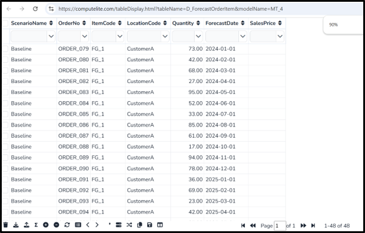
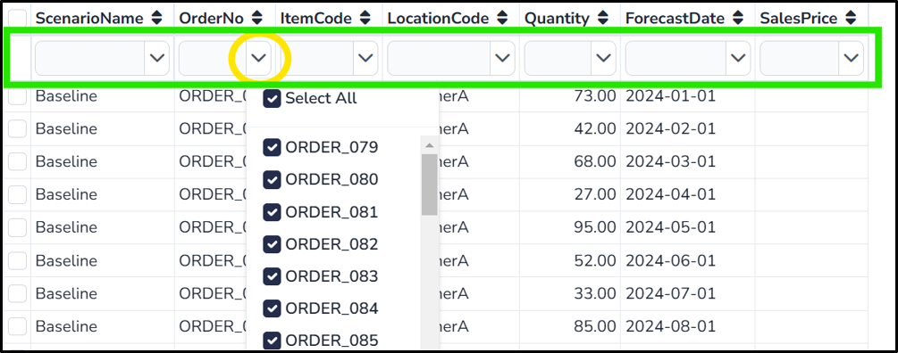

(table_display)=

# Table Display

User can view/insert/update and delete SQLITE data tables from **Table Display** page

A Table is editable, only if it is characterized as an **Input** table in **S_TableGroup** table

## Table Filters

User can filter any table by typing in first row (highlighted in green) and then hit enter or selecting a memeber for respective column by click on LOV button (highligted in yellow)

To clear all the filters, user can click on button

## Table Sort

User can filter any table by clicking on **Sort** icons (highlighted in yellow) in header row. To save 

